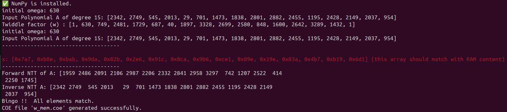

# Folded Architecture of Forward NTT
If vivado and python environment are properly installed then just write
```
./run
```
The ./run file will generate all the required vhdl files of forward ntt.
The run file has two variables n and q where n is the degree of the polynomial and q is the modulous. You can change the value of n and q in 'src/variant_pkg.vhd. as per your requirement. 
To verify your output please follow the print in red color in the terminal




It is to be noted that final output of the forward NTT (as shown in terminal) will  not be actual content of the RAM (in Vivado testbench). It will be the bit reverse value of RAM. That means the address of the ram should be reversed fliped. For and example if you 5th polynomial co-efficnet, you need to reverse 5 ('0101') to 10 ('1010'). Instead of 5th content of the ram you need to take 10th content of the ram. you need to take 4 bits because the number of coefficnets are 16 which need log16=4 bits.
For verification you need to match the value of X with ram contents.
