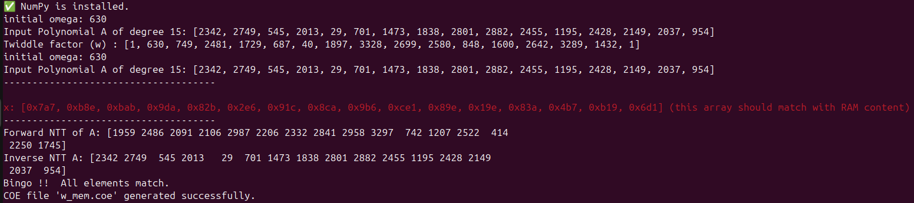
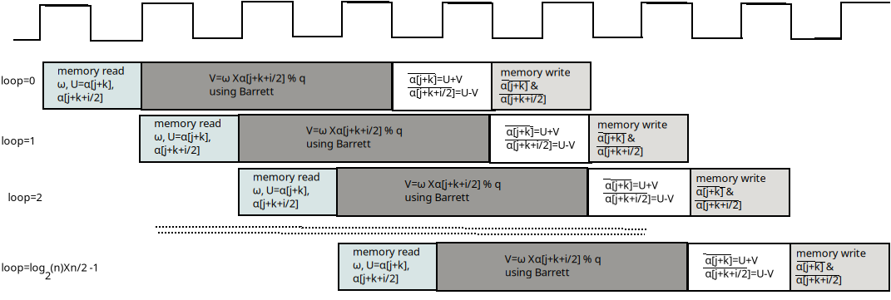
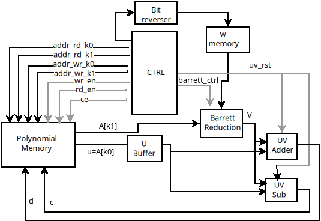

# Pipelined Architecture of Forward NTT
If vivado and python environment are properly installed then just write
```
./run
```
The ./run file will generate all the required vhdl files of forward ntt.
The run file has two variables n and q where n is the degree of the polynomial and q is the modulous. You can change the value of n and q in line 37 and line 38 of the 'run' file. as per your requirement. 
To verify your output please follow the print in red color in the terminal




It is to be noted that final output of the forward NTT (as shown in terminal) will  not be actual content of the RAM (in Vivado testbench). It will be the bit reverse value of RAM. That means the address of the ram should be reversed fliped. For an example if you need 5th polynomial co-efficnet, you need to reverse 5 ('0101') to 10 ('1010'). Instead of 5th content of the ram you need to take 10th content of the ram. Therfore 10th content of the ram is 0x89e which comes at the 5th position (2206 in decimal) of Forward NTT of A. you need to take 4 bits because the number of coefficnets are 16 which need log16=4 bits.
For verification you need to match the value of X with ram contents.

| File Names         | Features           Proposed SampleNTT  |
|--------------------|----------------------------------------|
| run                | This the main file to execute. This file calls  run_vivado.tcl and  mem_gen.py     |
| run_vivado.tcl     | run file call this file to run vivado. This file add all the source files. Create memory for w  |
| mem_gen.py         | The hw file require memory to store w, it generates two polynomials memory to store w and A of degree n      |
| fntt.py            | This file is to run forward NTT of A in python, it helps to validate the ram content genreated from RTL |
| tb/                | Test bench file                        |
| src/               | All vhd source files                   |

## Number of Clck Cycle=(Number of Stages−1)+Number of Loop
=(5-1)+1024
=1028

## number of loop=log_2(n)xn/2
=log_2(256)x256/2
=8x128
=1024
## Implementation Cost 
<!-- for q=3329 and n=256 and FPGA is xc7a100tcsg324
| Design Name     | Slice |   Power(mw)  | Energy (nJ) | # of CC | Critical Path (ns)| Clock Period (ns)|
|-----------------|-------|--------------|-------------|---------|-------------------|-------------|
| NTT             |2004   | 169          |  3462          | 1028     | 14.3              | 20  | -->

 without PolyMem for q=3329 and n=256 and FPGA is xc7a100tcsg324

| Design Name     | Slice |   Power(mw)  | Energy (nJ) | # of CC | Critical Path (ns)| Clock Period (ns)|
|-----------------|-------|--------------|-------------|---------|-------------------|------------------|
| NTT             |104    |  85          |  1747        | 1028    | 15.3             | 20               |
| CFI with NTT    |106    |  86          |  1767        | 1028    | 14               | 20               |




<!-- 
| Name                                               | Slice LUTs | Slice Registers | F7 Muxes | F8 Muxes | Slice | LUT as Logic | LUT as Memory | Slice Registers | Block RAM Tile | DSPs |
|----------------------------------------------------|------------|-----------------|----------|----------|-------|--------------|---------------|-----------------|----------------|------|
| fntt                                              | 6035       | 3275            | 537      | 214      | 2004  | 6027         | 8             | 3275            | 0              | 4    |
| w_mem_DUT (w_mem)                                  | 46         | 7               | 21       | 10       | 15    | 46           | 0             |                 | 0              | 0    |
| U0 (w_mem_dist_mem_gen_v8_0_12)                    | 46         | 7               | 21       | 10       | 15    | 46           | 0             |                 | 0              | 0    |
| synth_options.dist_mem_inst (w_mem_dist_mem_gen_v8_0_12_synth) | 46 | 7               | 21       | 10       | 15    | 46           | 0             |                 | 0              | 0    |
| gen_rom.rom_inst (w_mem_rom)                       | 46         | 7               | 21       | 10       | 15    | 46           | 0             |                 | 0              | 0    |
| u_buf_DUT (u_buff)                                 | 27         | 24              | 0        | 0        | 23    | 27           | 0             |                 | 0              | 0    |
| poly_mem_DUT (poly_mem)                            | 1803       | 3084            | 516      | 204      | 1763  | 1803         | 0             |                 | 0              | 0    |
| ijk_gen_DUT (index_gen)                           | 199        | 63              | 0        | 0        | 75    | 199          | 0             |                 | 0              | 0    |
| barrett_DUT (barrett_pipe)                         | 73         | 26              | 0        | 0        | 23    | 73           | 0             |                 | 0              | 4    |
| c_shift_DUT (c_shifter)                            | 22         | 14              | 0        | 0        | 11    | 22           | 0             |                 | 0              | 2    |
| R_come_DUT (r_com)                                 | 54         | 12              | 0        | 0        | 18    | 54           | 0             |                 | 0              | 2    |
| addr_buf_DUT (addr_buf)                           | 3736       | 70              | 0        | 0        | 1640  | 3728         | 8             |                 | 0              | 0    |
| UV_sub_DUT (UV_sub)                               | 102        | 0               | 0        | 0        | 51    | 102          | 0             |                 | 0              | 0    |
| UV_adder_DUT (UV_adder)                           | 42         | 0               | 0        | 0        | 22    | 42           | 0             |                 | 0              | 0    |
-->
